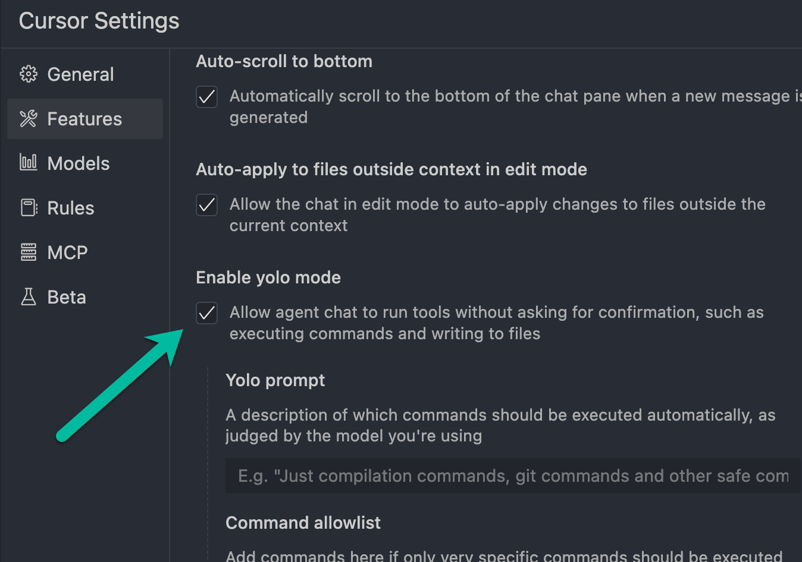

# 🥘 PAELLADOC

## 🎯 The Power of Context in AI Programming
PAELLADOC stems from a fundamental truth: **90% of success in AI programming depends on context**. Just as a good paella requires the precise combination of ingredients and technique, effective AI programming needs rich and well-structured context.

While expensive paid solutions claim to solve this problem, PAELLADOC delivers the same powerful context management **completely free**, directly integrated with your Cursor IDE. No subscriptions, no external services—just pure contextual intelligence at your fingertips.

### Why Context is Crucial
- 🧠 AIs are extremely powerful, but they need clear context
- 📚 Traditional documentation is often scattered and poorly structured
- 🎯 90% of time is wasted giving repetitive context to the AI
- 🔄 Without adequate context, we get generic or incorrect answers
- 💰 Paid solutions charge premium prices for what PAELLADOC offers for free

### The PAELLADOC Solution
Like a well-structured recipe, PAELLADOC organizes documentation following the MECE principle (Mutually Exclusive, Collectively Exhaustive) to provide:
- 📋 Complete and structured context
- 🎯 Specific and relevant documentation
- 🤖 AI-optimized format
- 🔍 Easy access to necessary information
- 💻 Direct integration with Cursor—no external tools required
- 🆓 All the power of premium context management solutions at zero cost

### Free vs. Paid Solutions
| Feature | PAELLADOC | Paid Alternatives |
|---------|-----------|-------------------|
| Rich context management | ✅ | ✅ |
| MECE documentation structure | ✅ | ✅ |
| Direct IDE integration | ✅ | ❌ or limited |
| Persistent memory | ✅ | ✅ |
| Development tracking | ✅ | ✅ |
| Cost | **FREE** | $20-100/month |
| External dependencies | **NONE** | Multiple services |
| Open source | ✅ | ❌ |
| Customizable templates | ✅ | Limited |

## 🌟 Main Features

### 1. Adaptive Documentation with Rich Context
- **Complete Products**: Comprehensive business, user, and technical context
- **Specific Features**: Context focused on integration and purpose
- **Bug Fixes**: Context of the problem and its impact
- **Quick Tasks**: Minimal but sufficient context

### 2. MECE System for Perfect Context
- **Mutually Exclusive**: Each piece of context has its place
- **Collectively Exhaustive**: Nothing important is left out
- **Adaptable**: The level of context adjusts to the need

### 3. Organized Structure
```
paelladoc/
├── .notes/                    # The base ingredients
│   ├── 00_index.md           # The main recipe
│   ├── simplified_templates/  # Quick recipes
│   └── [templates...]        # Complete recipes
│
└── docs/                     # Your documentary paellas
    ├── products/            # Complete paellas
    ├── features/           # New ingredients
    ├── bugs/              # Corrections
    └── tasks/            # Quick tapas
```

### 4. MDC File for Cursor Project Rules

Upon completing the documentation process, PAELLADOC generates an MDC (Cursor Documentation Model) file specific to your project:

- **Location**: `docs/[type]/[project-name]/[project-name].mdc.example`
- **Purpose**: Provide complete context to Cursor AI during development
- **Content**: Configuration adapted to your project's specific documentation

**Structure of the generated MDC**:
```json
{
    "version": 1,
    "name": "PROJECT_NAME-docs",
    "description": "Complete documentation for PROJECT_NAME project",
    "patterns": ["**/*"],
    "rules": [
        {
            "name": "project-overview",
            "description": "Project overview",
            "patterns": ["**/*"],
            "instructions": [
                "# Project: PROJECT_NAME",
                "",
                "## General description",
                "PROJECT_DESCRIPTION",
                "",
                "## Project type",
                "PROJECT_TYPE (Complete product / Feature / Bug Fix / Task)",
                "",
                "## Available documentation",
                "This rule provides access to all project documentation..."
            ]
        },
        // Includes sections for:
        // - Project-specific documentation
        // - Important decisions
        // - Development memory
    ],
    "priorities": [
        {
            "source": "DOCS_PATH",
            "weight": 3.0
        }
    ],
    "project_directives": {
        "name": "PROJECT_NAME-documentation",
        "ai_first": true,
        "documentation_path": "DOCS_PATH",
        "memory_file_path": "MEMORY_FILE_PATH"
    }
}
```

**Real purpose of the MDC**: The MDC file provides Cursor AI with all the context of your project, allowing you to program with an assistant that truly understands:
- The structure and architecture of your product
- Design decisions and their reasons
- Requirements and limitations
- Project rules and conventions

To leverage this context in your development:
1. Copy the generated MDC file to the `.cursor/rules/` folder of your project
2. When programming with Cursor AI, the assistant will have access to all documented context
3. You'll get much more relevant code suggestions and responses aligned with your project
4. The assistant will understand the global vision, not just the current code fragment

This approach eliminates the need to repeatedly explain context, allowing you to focus on solving specific problems with an assistant that already understands your project in depth.

### 5. Development Memory

PAELLADOC includes a powerful development memory functionality that allows you to record progress, problems, and decisions during implementation:

- **Available commands**:
  - `LOGRO [description]`: Records a new achievement or progress in development
  - `PROBLEMA [description]`: Records a problem encountered during development
  - `DECISIÓN [description]`: Records an important technical decision
  - `MEMORIA`: Shows all stored records

- **Benefits**:
  - **Tracking**: Maintain a chronological record of all progress
  - **Automatic documentation**: Generate technical documentation while developing
  - **Team context**: Makes it easier for other members to understand decisions made
  - **Problem solving**: Record problems and their solutions for future reference

- **Operation**:
  - All information is automatically saved in a `dev_memory.json` file
  - The Cursor AI assistant can access this memory to offer more contextualized responses
  - You can filter memory by type (achievements, problems, decisions)
  - Memory stays synchronized with the project

This functionality turns PAELLADOC not just into an initial documentation tool, but into a continuous assistant throughout the development cycle.

## 🚀 How to Use

### The PAELLA Ritual
The process is simple: write `PAELLA` and the system:
1. Listens to your need (the dish you want to create)
2. Analyzes the necessary context
3. Recommends the best structure
4. Selects the perfect templates
5. Asks for the project name
6. Lets you choose the documentation language
7. Guides you in creating the documentation

### Intelligent Navigation
- Write `PASALA` at any time to skip to the next section
- This allows you to quickly advance through parts that aren't relevant to your case
- You can always go back to complete sections if necessary

### Documentation Types

#### a) Complete Product with Complete Needs
- Market research
- User analysis
- Comprehensive documentation
- Detailed planning

#### b) Complete Product with Specific Needs
- Technical focus
- Practical documentation
- Simplified analysis

#### c) New Feature
- Integration with existing product
- Specific documentation
- Implementation focus

#### d) Bug Fix
- Problem analysis
- Solution and prevention
- Tracking

#### e) Quick Task
- Minimal documentation
- Practical approach
- Direct implementation

## 🧠 Intelligent Features

### Persistent Memory System
PAELLADOC includes an intelligent memory system that automatically saves your progress:

- **Memory File**: Each project has its own `.memory.json`
- **Saved Content**:
  - All provided information
  - Completed and pending sections
  - Current project phase
  - Selected templates
  - Language preference

- **Benefits**:
  - **Continuity**: Resume exactly where you left off
  - **No losses**: Never lose information already provided
  - **Complete context**: The assistant remembers all previous context
  - **Flexibility**: Work on multiple projects by alternating between them

- **Usage**:
  - When starting PAELLA with an existing project, the system detects the memory file
  - It asks if you want to continue where you left off
  - You can resume work or start over

### Multilingual Support
PAELLADOC allows you to create documentation in different languages:

- Select your preferred language at the beginning of the process
- All templates and questions will automatically adapt
- The generated documentation will be completely in the chosen language
- Your language preference is saved in the memory file

## 🛠 Configuration and Resources

### Cursor Requirements
For PAELLADOC to work correctly with Cursor, you need to have **Yolo mode** enabled in the configuration:



This configuration allows the assistant to execute commands and write files automatically, which is essential for the smooth operation of PAELLADOC.

To activate Yolo Mode:
1. Go to Settings in Cursor (⚙️)
2. Navigate to the Features section
3. Enable the "Enable yolo mode" option
4. Make sure the description shows: "Allow agent chat to run tools without asking for confirmation"

No additional special configuration is required. Templates are organized in:
- `.notes/` for complete templates
- `.notes/simplified_templates/` for simplified templates

### Available Templates

#### Complete Templates
1. Market Research
2. User Research
3. Problem Definition
4. Product Definition
5. Roadmap
6. Architecture
7. Technical Specifications
8. And more...

#### Simplified Templates
1. Feature Documentation
2. Bug Documentation
3. Quick Task Documentation

## 💡 Optimized for AI
- Structure that AIs understand perfectly
- Rich and well-organized context
- Consistent and processable format
- MECE principles for maximum clarity

### Why PAELLADOC
Just as a paella combines diverse ingredients into a coherent dish:
- 🔍 Organizes context logically
- 🎯 Each element has its purpose
- 📚 Everything adds to the final result
- 🤖 AIs understand it perfectly

## 📋 Practical Guide

### Workflow
1. Start with the "PAELLA" command
2. Describe your need
3. Follow the assistant's recommendations
4. Complete documentation by phases
5. Review and update as needed

### Best Practices
1. Be specific in the initial description
2. Follow the MECE principle
3. Complete the relevant sections
4. Keep documentation updated
5. Use the recommended templates

### Use Cases
- Documentation of new products
- Feature documentation
- Bug tracking and monitoring
- Maintenance documentation
- Quick technical documentation

## 🤝 Contribution
The templates are designed to evolve. If you find areas for improvement:
1. Suggest modifications
2. Propose new templates
3. Share use cases

## 📜 License

This project is licensed under the MIT License - see the [LICENSE](LICENSE) file for details.

---

Ready to cook perfect documentation? Write "PAELLA" and let's get started! 🥘 