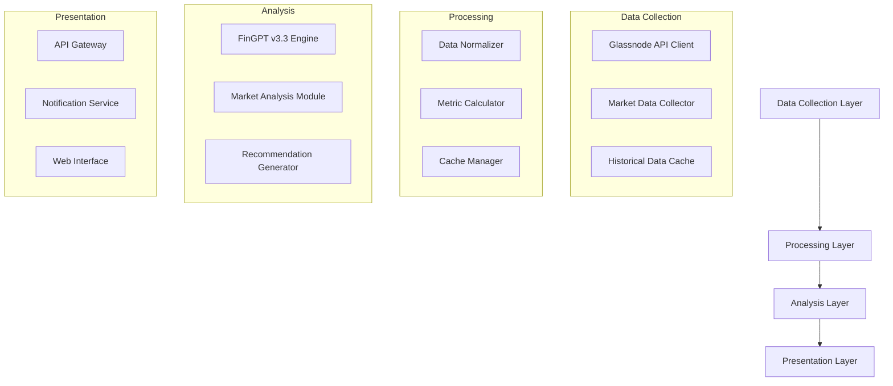
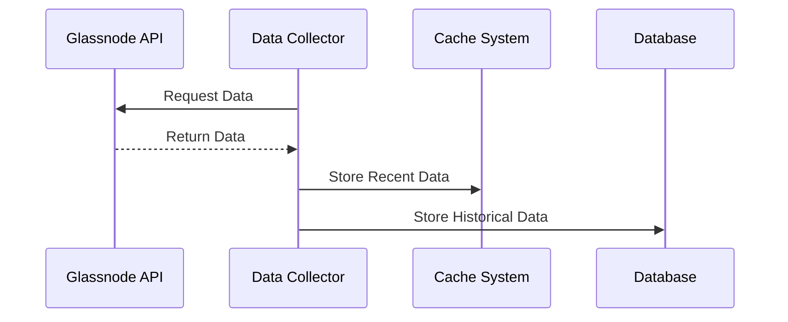
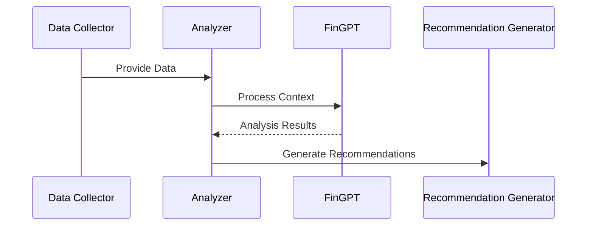

## Visión General
RECUENCO es una plataforma de análisis financiero que integra datos on-chain de Glassnode con procesamiento de lenguaje natural avanzado para proporcionar recomendaciones diarias de inversión en criptomonedas.

## Arquitectura del Sistema

### 1. Componentes Principales

### 2. Componentes Detallados

#### 2.1 Capa de Recolección de Datos
- **Glassnode API Client**
  - Integración con API v2
  - Gestión de rate limits
  - Manejo de autenticación
  - Recuperación de errores

- **Market Data Collector**
  - Métricas on-chain
  - Datos de mercado
  - Indicadores técnicos

- **Historical Data Cache**
  - Base de datos TimeSeries
  - Sistema de caché distribuido
  - Política de retención de datos

#### 2.2 Capa de Procesamiento
- **Data Normalizer**
  - Estandarización de datos
  - Limpieza y validación
  - Transformación de formatos

- **Metric Calculator**
  - Cálculo de métricas derivadas
  - Agregaciones temporales
  - Indicadores personalizados

- **Cache Manager**
  - Gestión de caché distribuida
  - Políticas de invalidación
  - Optimización de consultas

#### 2.3 Capa de Análisis
- **FinGPT v3.3 Engine**
  - Modelo base: Llama2-13b
  - Fine-tuning específico
  - Análisis de sentimiento
  - Procesamiento contextual

- **Market Analysis Module**
  - Análisis técnico
  - Patrones de mercado
  - Correlaciones

- **Recommendation Generator**
  - Lógica de decisión
  - Generación de señales
  - Validación de recomendaciones

#### 2.4 Capa de Presentación
- **API Gateway**
  - REST API
  - Autenticación
  - Rate limiting
  - Documentación OpenAPI

- **Notification Service**
  - Alertas en tiempo real
  - Notificaciones push
  - Resúmenes diarios

- **Web Interface**
  - Dashboard interactivo
  - Visualizaciones
  - Configuración de usuario

## Tecnologías y Stack

### 1. Backend
- **Lenguaje Principal**: Python 3.11+
- **Framework Web**: FastAPI
- **Base de Datos**:
  - TimescaleDB (datos temporales)
  - PostgreSQL (datos relacionales)
  - Redis (caché)

### 2. IA y Procesamiento
- **LLM**: FinGPT v3.3
- **Framework ML**: PyTorch
- **Procesamiento**: CUDA 12.0+
- **Hardware**: NVIDIA RTX 3090 (mínimo)

### 3. Frontend
- **Framework**: Next.js 14
- **UI Library**: Tailwind CSS
- **Gráficos**: TradingView
- **Estado**: Redux Toolkit

### 4. Infraestructura
- **Contenedores**: Docker
- **Orquestación**: Kubernetes
- **CI/CD**: GitHub Actions
- **Monitoreo**: Prometheus + Grafana

## Flujos de Datos

### 1. Recolección de Datos

### 2. Análisis y Recomendaciones

## Consideraciones de Seguridad

### 1. Protección de Datos
- Encriptación en reposo
- Encriptación en tránsito
- Gestión segura de API keys
- Auditoría de accesos

### 2. Autenticación y Autorización
- JWT para autenticación
- RBAC para autorización
- 2FA para accesos críticos
- Rate limiting por usuario

### 3. Infraestructura
- Network policies
- Security groups
- WAF configuration
- DDoS protection

## Escalabilidad y Rendimiento

### 1. Estrategias de Escalado
- Escalado horizontal de servicios
- Caché distribuida
- Load balancing
- Database sharding

### 2. Optimizaciones
- Query optimization
- Batch processing
- Async operations
- Resource pooling

## Monitoreo y Observabilidad

### 1. Métricas Clave
- Latencia de API
- Uso de recursos
- Precisión de predicciones
- Tasa de éxito de recomendaciones

### 2. Logging y Tracing
- Structured logging
- Distributed tracing
- Error tracking
- Performance monitoring

## Plan de Implementación

### Fase 1: MVP
1. Integración básica con Glassnode
2. Implementación de FinGPT
3. API REST básica
4. Dashboard simple

### Fase 2: Escalado
1. Sistema de caché distribuido
2. Mejoras en análisis
3. Notificaciones
4. Optimizaciones de rendimiento

### Fase 3: Enterprise
1. Multi-tenant support
2. Advanced analytics
3. Custom integrations
4. Enhanced security

## Mantenimiento y Operaciones

### 1. Backups
- Database backups
- Configuration backups
- Disaster recovery plan

### 2. Updates
- Rolling updates
- Canary deployments
- Version control
- Migration strategies

## Documentación Adicional
- [API Specification](../api_specification.md)
- [Database Schema](../database_design.md)
- [Deployment Guide](../deployment_guide.md)
- [Security Policies](../security_policies.md)

---
*Este documento es parte de la documentación oficial del proyecto RECUENCO y está sujeto a actualizaciones continuas.* 